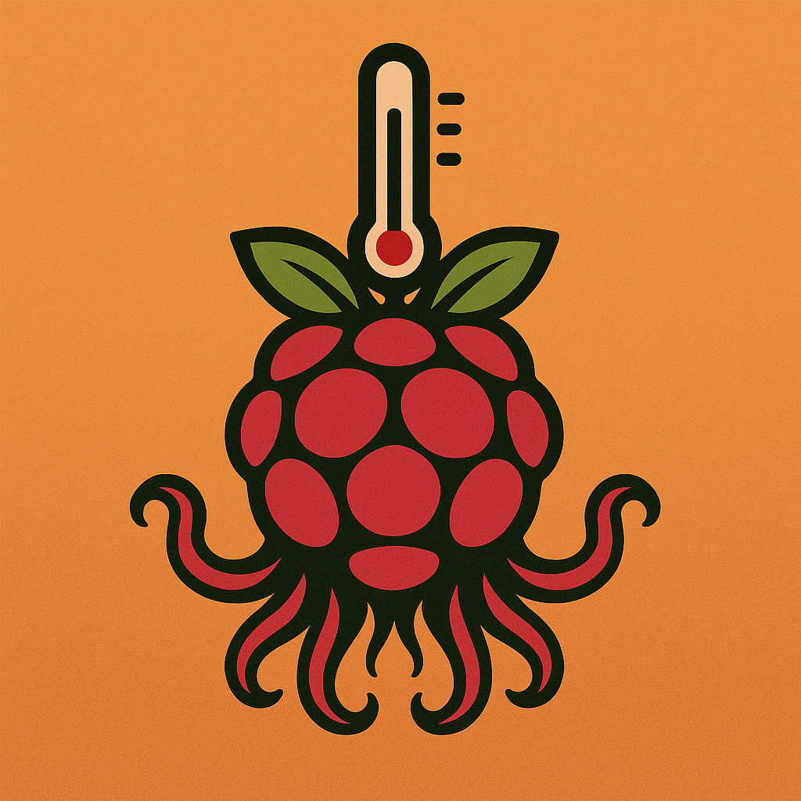
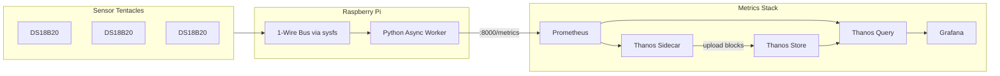

<p align="center">
  
</p>

<h1 align="center">Thermopus</h1>

<p align="center">
  <em>Multi-sensor temperature monitoring for Raspberry Pi with Prometheus, Thanos & Grafana</em>
</p>

<p align="center">
  <a href="#quick-start"></a>
  <a href="#python-async-worker"></a>
  <a href="#license"></a>
  <a href="#ds18b20-temperature-sensors"></a>
  <a href="#prometheus--thanos"></a>
  <a href="#prometheus--thanos"></a>
  <a href="#access-the-dashboards"></a>
</p>

<p align="center">
  <strong>🌡️ Raspberry Pi Temperature Logger | 📊 Real-Time Monitoring | 📈 Long-Term Storage | 🔌 Hot-Plug Sensors</strong>
</p>

---

## Overview

**Thermopus** is an open-source, self-hosted temperature monitoring solution that transforms a **Raspberry Pi** into a powerful multi-location temperature station. Using **DS18B20 digital temperature sensors** connected via the **1-Wire protocol**, Thermopus auto-discovers sensors, collects readings, and stores them in a production-grade **Prometheus + Thanos** time-series database with beautiful **Grafana dashboards**.

> **Think of it as**: The octopus body (Pi) with sensor tentacles reaching out to measure temperatures everywhere — hence *thermal* + *octopus* = **Thermopus** 🐙

### Key Features

| Feature | Description |
|---------|-------------|
| 🔍 **Auto-Discovery** | Plug in a new DS18B20 sensor — automatically detected and tracked |
| 🔌 **Hot-Plug Support** | Connect or disconnect sensors on the fly; system adapts in real-time |
| 📍 **Multi-Location** | Monitor temperatures across multiple spots from a single Raspberry Pi |
| 📦 **Long-Term Storage** | Historical data preserved via Thanos for weeks/months of trend analysis |
| 📊 **Grafana Dashboards** | Beautiful real-time visualization out of the box |
| 🐳 **Docker Deployment** | Single `docker compose up` brings the entire stack online |
| ⚡ **Async Python** | Non-blocking concurrent sensor reads with exponential backoff |
| 🏷️ **Custom Labels** | Name your sensors (Fridge, Freezer, Server Rack, etc.) |

---

## Use Cases

Thermopus is perfect for **IoT temperature monitoring**, **home automation**, and **industrial applications**:

| Use Case | Application |
|----------|-------------|
| 🏠 **Smart Home** | Room temperatures, HVAC efficiency, basement/attic monitoring |
| 🧊 **Cold Chain Monitoring** | Fridges, freezers, food storage compliance |
| 🖥️ **Server Room / Data Center** | Rack temperatures, hot spot detection, cooling efficiency |
| 🐠 **Aquarium Monitoring** | Water temperature stability for fish tanks |
| 🍺 **Fermentation Tracking** | Beer brewing, wine making, kombucha temperature control |
| 🌱 **Greenhouse / Agriculture** | Soil and air temperature logging for plants |
| ☀️ **Solar / HVAC Systems** | Inlet/outlet temperatures, heat exchanger efficiency |
| 🏭 **Industrial Monitoring** | Process temperature tracking, equipment monitoring |

---

## Architecture



### Data Flow

1. **DS18B20 sensors** connect to the Pi's GPIO via the 1-Wire protocol
2. The **Python worker** scans `/sys/bus/w1/devices/` to auto-discover sensors
3. Temperature readings are taken concurrently and exposed as **Prometheus metrics**
4. **Prometheus** scrapes the worker every 5 seconds
5. **Thanos Sidecar** uploads TSDB blocks to long-term storage
6. **Thanos Query** federates real-time + historical data
7. **Grafana** visualizes everything on port 80

---

## Tech Stack

| Component | Purpose |
|-----------|---------|
| **Raspberry Pi** | Hardware platform (Pi 4/5 recommended) |
| **DS18B20** | Digital temperature sensor with 1-Wire interface |
| **Python 3.11+** | Async worker with prometheus-client, pydantic |
| **Prometheus** | Time-series database and metrics collection |
| **Thanos** | Long-term storage, global querying, high availability |
| **Grafana** | Visualization and dashboards |
| **Docker Compose** | Container orchestration |

---

## Technical Choices

### DS18B20 Temperature Sensors

The DS18B20 is the perfect sensor for this project:

- **Digital output** — no ADC required, direct digital readings
- **Unique 64-bit ROM code** — each sensor has a factory-burned ID, enabling auto-identification
- **1-Wire protocol** — multiple sensors share a single GPIO pin
- **Accuracy** — ±0.5°C from -10°C to +85°C
- **Waterproof variants** — available in probe form for liquids

### 1-Wire Protocol & Linux sysfs

The Linux kernel's `w1-gpio` and `w1-therm` drivers expose sensors as files under `/sys/bus/w1/devices/`. This approach:

- Requires no custom drivers or libraries
- Works reliably across Raspberry Pi models
- Supports hot-plug detection via filesystem watching
- Each sensor appears as `28-xxxxxxxxxxxx/w1_slave`

### Python Async Worker

The worker uses Python's `asyncio` for:

- **Non-blocking I/O** — concurrent sensor reads without thread overhead
- **Backoff on errors** — exponential backoff prevents hammering faulty sensors
- **State machine per sensor** — tracks NEW → ACTIVE → STALE → ERROR → MISSING transitions
- **Structured logging** via `structlog` for easy debugging

### Prometheus + Thanos

- **Prometheus** provides battle-tested time-series storage with powerful querying (PromQL)
- **Thanos** extends Prometheus with:
  - Unlimited retention via object storage (local filesystem in this POC)
  - Global query view across multiple data sources
  - Downsampling for efficient long-term queries

### Docker Compose

Single-command deployment (`docker compose up`) brings up:
- Python worker with GPIO/sysfs access
- Prometheus with 15-day retention
- Thanos sidecar, store gateway, and query components
- Grafana on port 80

---

## Project Structure

```
thermopus/
├── docker-compose.yml      # Full stack orchestration
├── assets/
│   └── thermopus.png       # Project logo
├── prometheus/
│   └── prometheus.yml      # Scrape config for the worker
├── thanos/
│   └── objstore.yml        # Local filesystem "bucket" config
└── worker/
    ├── Dockerfile
    ├── pyproject.toml      # Python dependencies (prometheus-client, pydantic, etc.)
    └── src/
        ├── main.py         # Async entrypoint, wires up all loops
        ├── config/         # Pydantic settings from env vars
        ├── core/           # Enums, events, type definitions
        ├── io/             # 1-Wire sysfs reading & filesystem watching
        ├── loops/          # Scanner, Reader, Reporter async loops
        ├── metrics/        # Prometheus gauge/counter definitions
        ├── sensors/        # DS18B20 model and SensorSet registry
        └── util/           # Logging, asyncio helpers, duration parsing
```

---

## Quick Start

### Prerequisites

- **Raspberry Pi** (tested on Pi 4/5) with Raspberry Pi OS
- **Docker** and **Docker Compose** installed
- **DS18B20 sensors** wired to GPIO (default: GPIO 4)
- **1-Wire enabled** in the Pi's boot config

### 1. Enable 1-Wire on the Raspberry Pi

Edit `/boot/firmware/config.txt` (or `/boot/config.txt` on older OS versions):

```ini
# Single bus on GPIO 4 (default)
dtoverlay=w1-gpio,gpiopin=4,pullup=1

# Or multiple buses on different pins
dtoverlay=w1-gpio,gpiopin=4,pullup=1
dtoverlay=w1-gpio,gpiopin=17,pullup=1
dtoverlay=w1-gpio,gpiopin=22,pullup=1
```

Reboot and verify sensors are detected:

```bash
ls /sys/bus/w1/devices/
# Should show: w1_bus_master1  28-00000xxxxxxx  ...
```

### 2. Clone and Start

```bash
git clone https://github.com/yourusername/thermopus.git
cd thermopus
docker compose up -d
```

### 3. Access the Dashboards

| Service        | URL                          |
|----------------|------------------------------|
| Grafana        | http://raspberry-pi:80       |
| Prometheus     | http://raspberry-pi:9090     |
| Thanos Query   | http://raspberry-pi:10902    |
| Worker Metrics | http://raspberry-pi:8000     |

Default Grafana credentials: `admin` / `admin`

---

## Configuration

The worker is configured via environment variables (prefix: `WORKER_`):

| Variable                | Default | Description                                      |
|-------------------------|---------|--------------------------------------------------|
| `WORKER_PINS`           | `4`     | Comma-separated BCM GPIO pins for 1-Wire buses   |
| `WORKER_METRICS_PORT`   | `8000`  | Prometheus metrics HTTP port                     |
| `WORKER_SCAN_INTERVAL`  | `5s`    | How often to scan for new/removed sensors        |
| `WORKER_READ_INTERVAL`  | `2s`    | How often to read each sensor                    |
| `WORKER_READ_TIMEOUT`   | `1s`    | Timeout for individual sensor reads              |
| `WORKER_LOG_LEVEL`      | `INFO`  | Logging verbosity (DEBUG, INFO, WARNING, ERROR)  |
| `WORKER_USE_INOTIFY`    | `false` | Use inotify instead of polling for hot-plug      |
| `WORKER_LABEL_MAP`      | `{}`    | JSON map of ROM codes to friendly names          |
| `WORKER_DISABLED_ROMS`  | `[]`    | List of ROM codes to ignore                      |

### Example Label Map

Give your sensors human-friendly names:

```bash
WORKER_LABEL_MAP='{"28-00000abcdef0":"Fridge","28-00000fedcba0":"Freezer","28-000001234567":"Outside"}'
```

These labels appear in Prometheus metrics and Grafana dashboards.

---

## Exposed Metrics

The worker exposes Prometheus metrics at `/metrics`:

| Metric                          | Type    | Labels                              | Description                        |
|---------------------------------|---------|-------------------------------------|------------------------------------|
| `ds18b20_temperature_celsius`   | Gauge   | `rom`, `bus`, `gpio`, `label`       | Current temperature reading        |
| `ds18b20_read_latency_ms`       | Gauge   | `rom`, `bus`, `gpio`, `label`       | Time to read sensor (milliseconds) |
| `ds18b20_read_total`            | Counter | `rom`, `bus`, `gpio`, `label`       | Total successful reads             |
| `ds18b20_read_errors_total`     | Counter | `rom`, `bus`, `gpio`, `label`, `reason` | Total read errors by type     |
| `ds18b20_sensor_state`          | Gauge   | `rom`, `bus`, `gpio`, `label`, `state`  | Sensor state (1 = current)    |

---

## How It Works: The Three Loops

The worker runs three concurrent async loops:

### Scanner Loop
- Watches `/sys/bus/w1/devices/` for changes (polling or inotify)
- Detects sensor connect/disconnect events
- Reconciles physical devices with the in-memory `SensorSet`
- Emits `BusDiscovered`, `SensorConnected`, `SensorDisconnected` events

### Reader Loop
- Periodically reads all eligible sensors with bounded concurrency
- Applies exponential backoff on errors to avoid hammering faulty sensors
- Manages sensor state transitions: NEW → ACTIVE → STALE → ERROR
- Updates Prometheus metrics on success/failure

### Reporter Loop
- Starts the Prometheus HTTP server
- Periodically snapshots all sensor states to keep gauges synchronized
- Handles metric cleanup when sensors go missing (creates gaps in graphs)

---

## Wiring Diagram

```
                    Raspberry Pi
                   ┌────────────────┐
                   │                │
    ┌──────────────┤ GPIO 4 (1-Wire)├──────────┬──────────┬──────────┐
    │              │                │          │          │          │
    │   ┌──────────┤ 3.3V           │          │          │          │
    │   │          │                │          │          │          │
    │   │  ┌───────┤ GND            │          │          │          │
    │   │  │       └────────────────┘          │          │          │
    │   │  │                                   │          │          │
    │   │  │   4.7kΩ                           │          │          │
    │   │  │  ┌─────┐                          │          │          │
    └───┼──┼──┤     ├──────────────────────────┘          │          │
        │  │  └─────┘                                     │          │
        │  │                                              │          │
    ┌───┴──┴───┐                              ┌───────────┴┐    ┌────┴──────┐
    │ DS18B20  │                              │  DS18B20   │    │  DS18B20  │
    │(Sensor 1)│                              │ (Sensor 2) │    │ (Sensor 3)│
    └──────────┘                              └────────────┘    └───────────┘

    Pin 1: GND (black)
    Pin 2: Data (yellow) → GPIO 4 + 4.7kΩ pull-up to 3.3V
    Pin 3: VDD (red) → 3.3V
```

> **Note**: A single 4.7kΩ pull-up resistor between VDD and Data is required. Multiple sensors share the same three wires (parasitic power mode also works with just two wires).

---

## Troubleshooting

### No sensors detected

1. Check wiring — ensure pull-up resistor is present
2. Verify 1-Wire is enabled: `ls /sys/bus/w1/devices/`
3. Check kernel modules: `lsmod | grep w1`
4. Reload modules: `sudo modprobe w1-gpio && sudo modprobe w1-therm`

### Container can't access sensors

Ensure the worker container has:
- `privileged: true` or appropriate device mappings
- Volume mount: `/sys/bus/w1/devices:/sys/bus/w1/devices:ro`

### CRC errors in logs

- Check wiring quality and cable length
- Ensure adequate power to sensors
- Try reducing read frequency with `WORKER_READ_INTERVAL=5s`

---

## Related Projects & Inspiration

- [prometheus-client](https://github.com/prometheus/client_python) - Python Prometheus client
- [Thanos](https://thanos.io/) - Highly available Prometheus setup
- [Grafana](https://grafana.com/) - Observability platform
- [w1thermsensor](https://github.com/timofurrer/w1thermsensor) - Python library for 1-Wire sensors

---

## License

This project is licensed under the MIT License - see the [LICENSE](LICENSE) file for details.

---

<p align="center">
  <sub>Built with 🐙 for fun</sub>
</p>
